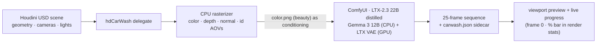
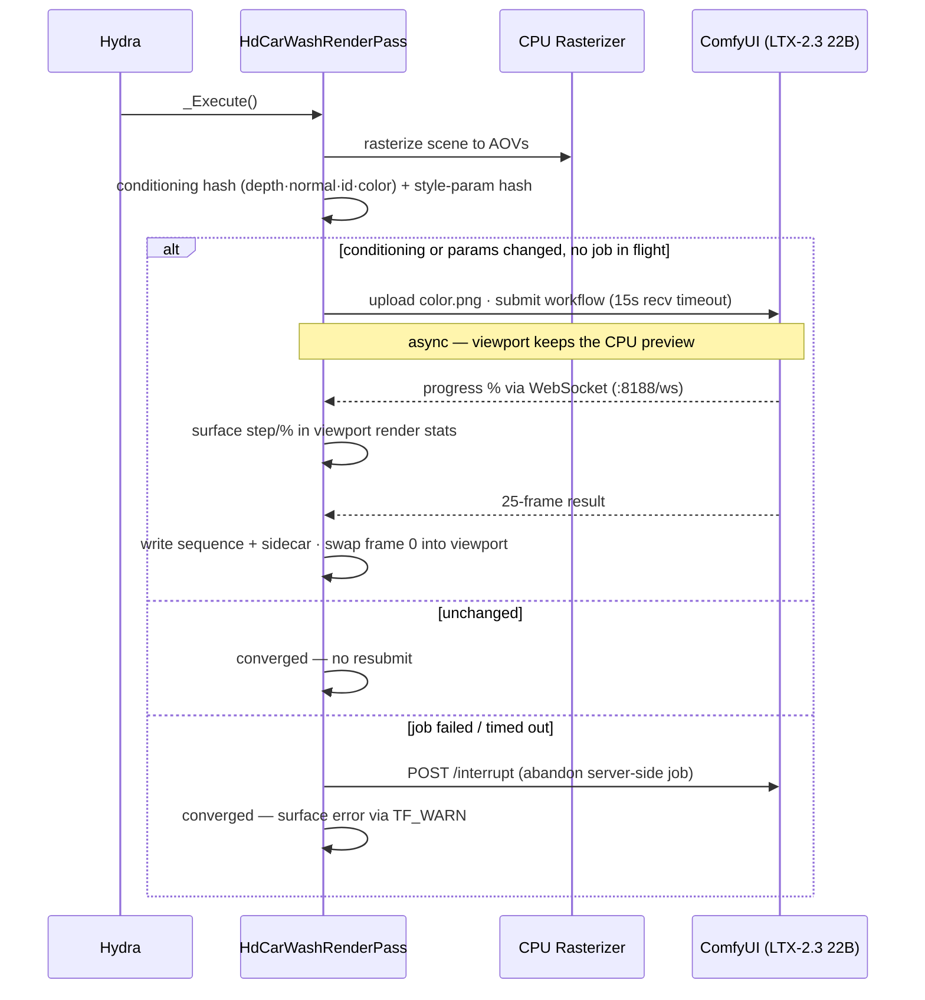
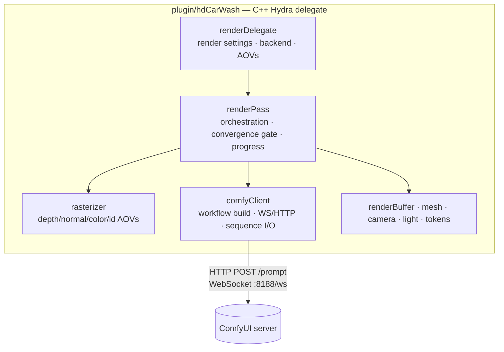

# hdCarWash

**Scene-conditioned AI video generation, native to Houdini's Solaris viewport.**

hdCarWash is a Houdini/USD **Hydra render delegate** that rasterizes your scene on the CPU and turns it into AI-generated video through [ComfyUI](https://github.com/comfyanonymous/ComfyUI) (LTX-2.3 22B distilled). It conditions the model on your **actual shaded render** — not just a depth pass — so the generated video is grounded in the scene's real composition, lighting, and color. It appears as a renderer inside Houdini's render settings and runs asynchronously, keeping the viewport responsive while frames generate.

---

## How It Works



1. **Scene export** — the delegate receives USD prims from Houdini's Hydra viewport.
2. **Rasterization** — a deterministic CPU rasterizer renders the scene to AOV buffers: shaded color, depth, world normals, and object/prim IDs.
3. **Conditioning** — the shaded color buffer is uploaded to ComfyUI as the first-frame conditioning image (depth/normal AOVs are uploaded too, reserved for a future control branch).
4. **Generation** — an LTX-2.3 22B distilled image-to-video workflow generates a 25-frame clip conditioned on that image plus the text prompt.
5. **Delivery** — every frame is downloaded and written to a per-generation directory with a metadata sidecar; frame 0 is shown in the viewport as a live preview. Generation progress (step count, %) surfaces via Houdini's native render stats panel.

### The render loop

The pass only submits a generation when something the model actually consumes has changed, then settles — it does **not** regenerate an unchanging scene on every redraw.



Change the camera, the geometry, a light, a material, or any prompt/seed/strength setting and the next frame re-triggers a generation; leave it alone and it converges. A failed or timed-out job converges rather than resubmit-looping.

### Output

Each generation is written to a self-describing directory (default base `C:/CarWashRenders`):

```
C:/CarWashRenders/<promptId>/
├── frame_0001.png … frame_0025.png   # the full sequence
└── carwash.json                       # prompt, seed, steps, guidance, size, frameCount …
```

Import the sequence as an image/texture sequence; the sidecar records the parameters behind each render for versioning.

---

## Architecture



| Component | Purpose |
|-----------|---------|
| **RenderDelegate** | Implements `HdRenderDelegate`; owns render settings (live edits via `SetRenderSetting`), backend selection, AOV descriptors |
| **RenderPass** | Per-frame orchestration: rasterize → hash conditioning → gate AI submission → apply/converge; surfaces progress and errors |
| **Rasterizer** | Deterministic CPU rasterizer producing color/depth/normal/id AOVs |
| **ComfyClient** | Builds the LTX-2.3 22B workflow JSON, submits over HTTP/WebSocket, downloads the full result sequence, reports progress and errors |

---

## Requirements

- **Houdini 21.0+** with USD/Hydra (pinned build target: 21.0.729). The deploy script auto-detects the newest installed Houdini and is version-agnostic — it will target 22.x the same way once it ships (pass `--houdini-version` to pin a specific install).
- **ComfyUI** with LTX-2.3 nodes installed, reachable on `localhost:8188`
- **Models** (see [Model Configuration](#model-configuration)):
  - `ltx-2.3-22b-distilled_transformer_only_fp8_input_scaled_v3.safetensors` (UNET, `diffusion_models/`)
  - `ltx-2.3-22b-distilled-fp8.safetensors` (checkpoint config, `checkpoints/`)
  - `gemma_3_12B_it_fp4_mixed.safetensors` (text encoder, `text_encoders/`)
  - `LTX23_video_vae_bf16.safetensors` (full 32x video VAE, `vae/`)
- **Windows** 10/11 (64-bit)
- **GPU** with ≥ 24 GB VRAM (RTX 4090 tested; the 22B fp8 transformer occupies ~22 GB — Gemma runs on CPU)

---

## Build & Deploy

### 1. Build the plugin

```bash
cmake -B build -G "Visual Studio 17 2022" -A x64 ^
  -DCMAKE_PREFIX_PATH="C:/Program Files/Side Effects Software/Houdini 21.0.729"
cmake --build build --target hdCarWash --config Release
```

Point `CMAKE_PREFIX_PATH` at whichever install you build against (the
`<Houdini install>/toolkit/cmake` dir). The same tree builds against 22.x
when it ships.

### 2. Deploy to Houdini

```bash
python deploy_hdcarwash.py                    # auto-detect newest install: build + deploy
python deploy_hdcarwash.py --houdini-version 21.0.729   # pin a specific install
python deploy_hdcarwash.py --skip-build       # deploy an already-built DLL
```

The deploy script resolves the Houdini install and user-pref dir from the
version (no hardcoded `houdini21.0` path). It copies `hdCarWash.dll` to
`~/houdini<major>.<minor>/dso/usd/hdCarWash/lib/`, installs the delegate
`plugInfo.json`, deploys the **`usdCarWash` schema resource plugin** (so the
CarWash tab registers in the Render Settings LOP), and writes the Houdini
package that sets `PXR_PLUGINPATH_NAME` for both plugin roots. It refuses to
run while Houdini is open (the DLL would be locked). A restart is required
after each deploy.

### 3. Download models

```powershell
./download_models.ps1
```

Or place the model files manually in ComfyUI's `models/` directories (see [Model Configuration](#model-configuration)).

---

## Usage

1. **Start ComfyUI** on port 8188.
2. **Launch Houdini** and build a Solaris (LOP) scene with geometry, a camera, and lights.
3. **Add a Render Settings LOP** and select **CarWash** as the renderer.
4. **Set the prompt and parameters** (see the table below). Generation runs asynchronously; the viewport shows the CPU rasterization until the AI frame lands.
5. Output frames are written under `C:/CarWashRenders/<promptId>/`.

> **Driving settings today:** the CarWash Render Settings *tab* is shipped by the deploy script but its appearance is pending verification against the target Houdini (see [Status](#status--known-limitations)). If the tab is not yet visible, set parameters via the `RenderSettings` prim's `carwash:*` attributes. The delegate reads live edits correctly once they reach it.

### Render Settings

| Parameter | Token | Default | Description |
|-----------|-------|---------|-------------|
| Prompt | `carwash:prompt` | photorealistic 3D render… | What to generate |
| Negative prompt | `carwash:negativePrompt` | blurry, low quality, distorted | What to avoid |
| Inference steps | `carwash:inferenceSteps` | **8** | Denoising steps (LTX-2.3 distilled sweet spot) |
| Guidance scale | `carwash:guidanceScale` | 7.5 | Prompt adherence |
| Seed | `carwash:seed` | 42 | Base seed (time-jittered unless deterministic mode) |
| Deterministic mode | `carwash:deterministicMode` | false | Fix seed — same scene + seed → identical result |
| Conditioning strength | `carwash:controlNet:depthStrength` | 0.8 | LTXVImgToVideo strength on the color image |
| Generation timeout | `carwash:comfyuiTimeoutSeconds` | 300 | Seconds before the job is abandoned and interrupted |
| Backend | `carwash:backend` | ltx2 | AI backend (ltx2 / flux / cosmos) |

---

## Model Configuration

```
┌─────────────────────────────────────────────────────────────────────┐
│ LTX-2.3 22B Distilled Configuration                                  │
├─────────────────────────────────────────────────────────────────────┤
│ UNET (transformer):                                                   │
│   ltx-2.3-22b-distilled_transformer_only_fp8_input_scaled_v3         │
│   → diffusion_models/   weight_dtype: fp8_e4m3fn   ~22 GB VRAM       │
│                                                                       │
│ Checkpoint (config + tokenizer):                                      │
│   ltx-2.3-22b-distilled-fp8.safetensors                               │
│   → checkpoints/                                                      │
│                                                                       │
│ Text encoder:                                                         │
│   gemma_3_12B_it_fp4_mixed.safetensors                               │
│   → text_encoders/   runs on CPU (offloaded to free VRAM)            │
│                                                                       │
│ VAE (full 32× spatial):                                               │
│   LTX23_video_vae_bf16.safetensors                                    │
│   → vae/   bf16   ~1.35 GB                                           │
│                                                                       │
│ Resolution:   multiples of 32, up to viewport size                   │
│ Frame count:  25 frames                                               │
│ Frame rate:   25 FPS                                                  │
│ Steps:        8 (distilled; more steps rarely help)                   │
└─────────────────────────────────────────────────────────────────────┘
```

> **VAE note:** `taeltx2_3.safetensors` (tiny TAESD, ~22 MB) uses 16× spatial compression — incompatible with `LTXVImgToVideo`, which allocates the noise latent at `height // 32`. Use `LTX23_video_vae_bf16.safetensors` (full 32× VAE).

> **Gemma note:** the 22B transformer fills ~22 GB of VRAM on a 24 GB card. Gemma 3 12B runs on CPU to stay within budget. Do **not** change `device: cpu` in the workflow.

---

## Status & Known Limitations

hdCarWash is **pre-1.0** (v0.2). The core artist loop works end-to-end — live settings, generate-once-and-converge, scene-conditioned generation, full-sequence output, progress feedback, and clean error surfacing — but the following are still in progress:

- **Render Settings tab — schema plugin now deployed, registration pending H22 verification.** The `CarWashRenderSettingsAPI` USD schema is now built and shipped by `deploy_hdcarwash.py` (the `usdCarWash` resource plugin + `SchemasForRenderers` map). Final confirmation that the tab appears in the Render Settings LOP must be done against the target Houdini (the schema sources are regenerated via `usdGenSchema` for that build). Until verified, drive settings via the `RenderSettings` prim's `carwash:*` attributes.
- **Sidecar records the base seed, not the jittered `noise_seed`.** A non-deterministic render isn't bit-reproducible from the sidecar alone.

---

## Troubleshooting

**Plugin not appearing in Houdini** — verify `~/houdini<major>.<minor>/packages/hdCarWash.json` exists, that `PXR_PLUGINPATH_NAME` points at the folder containing `plugInfo.json` (the plugin root, not `resources/`), and that `~/houdini<major>.<minor>/dso/usd/hdCarWash/lib/hdCarWash.dll` exists. Re-run `python deploy_hdcarwash.py`.

**"ComfyUI rejected workflow — no prompt_id"** — ComfyUI returned an error instead of a `prompt_id`. The actual response body is now logged via `TF_WARN` in the Houdini console. Common causes: wrong model filenames, missing nodes, or ComfyUI still loading a prior job when the 15 s HTTP timeout fires.

**Shape mismatch error at `LTXVImgToVideo`** — you are using the TAESD VAE (`taeltx2_3`). Switch to `LTX23_video_vae_bf16.safetensors` (the full 32× VAE). TAESD uses 16× spatial, which is incompatible with the node's latent allocation.

**Out of VRAM at `CLIPTextEncode` / `SamplerCustomAdvanced`** — the workflow sets `device: cpu` for Gemma 3 12B. If you see OOM at the sampler, close GPU-heavy applications and try again; the 22B transformer leaves only ~2 GB headroom on a 4090.

**ComfyUI connection failed** — confirm ComfyUI is running on `localhost:8188` and that the firewall allows local WebSocket/HTTP connections.

---

## Development

Enable debug output (logs conditioning hash, convergence state, submission, download/sequence details to `C:/Temp/hdcarwash_debug.txt`):

```bash
set TF_DEBUG=HD_CARWASH
```

Run tests:

```bash
cd tests
python -m pytest test_determinism.py -v
python -m pytest test_comfyui_nodes.py -v
```

---

## License

Proprietary. All rights reserved. © 2026 Joseph O. Ibrahim.

---

## Acknowledgments

- **SideFX** — Houdini and the USD/Hydra framework
- **Lightricks** — LTX-2.3 video generation model
- **Google** — Gemma 3 text encoder
- **ComfyUI** — node-based diffusion interface

---

*Built against Houdini 21.0.729 · version-agnostic build/deploy (21.0 → 22.x) · ComfyUI · LTX-2.3 22B distilled · Gemma 3 12B*
