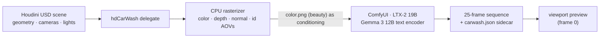
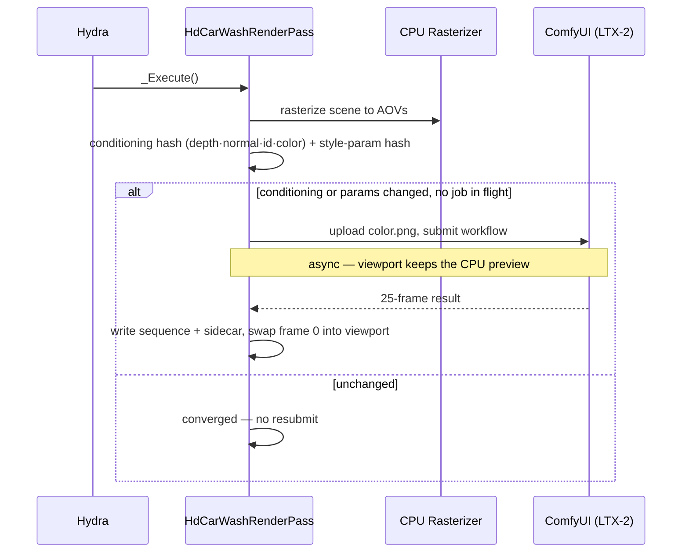
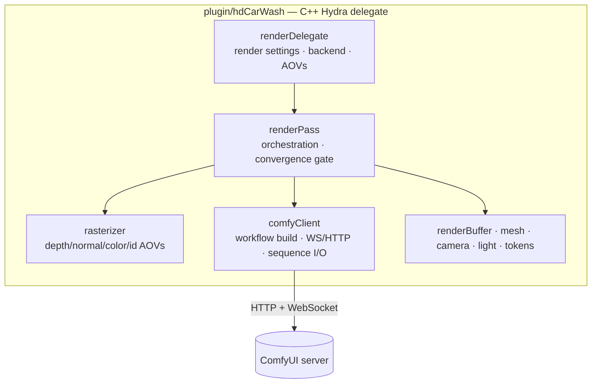

# hdCarWash

**Scene-conditioned AI video generation, native to Houdini's Solaris viewport.**

hdCarWash is a Houdini/USD **Hydra render delegate** that rasterizes your scene on the CPU and turns it into AI-generated video through [ComfyUI](https://github.com/comfyanonymous/ComfyUI) (LTX-2). It conditions the model on your **actual shaded render** — not just a depth pass — so the generated video is grounded in the scene's real composition, lighting, and color. It appears as a renderer inside Houdini's render settings and runs asynchronously, keeping the viewport responsive while frames generate.

---

## How It Works



1. **Scene export** — the delegate receives USD prims from Houdini's Hydra viewport.
2. **Rasterization** — a deterministic CPU rasterizer renders the scene to AOV buffers: shaded color, depth, world normals, and object/prim IDs.
3. **Conditioning** — the shaded color buffer is uploaded to ComfyUI as the first-frame conditioning image (depth/normal AOVs are uploaded too, reserved for a future control branch).
4. **Generation** — an LTX-2 image-to-video workflow generates a 25-frame clip conditioned on that image plus the text prompt.
5. **Delivery** — every frame is downloaded and written to a per-generation directory with a metadata sidecar; frame 0 is shown in the viewport as a live preview.

### The render loop

The pass only submits a generation when something the model actually consumes has changed, then settles — it does **not** regenerate an unchanging scene on every redraw.



Change the camera, the geometry, a light, a material, or any prompt/seed/strength setting and the next frame re-triggers a generation; leave it alone and it converges. A failed or timed-out job converges rather than resubmit-looping.

### Output

Each generation is written to a self-describing directory (default base `C:/CarWashRenders`):

```
C:/CarWashRenders/<promptId>/
├── frame_0001.png … frame_0025.png   # the full sequence
└── carwash.json                       # prompt, seed, steps, guidance, size, frameCount …
```

Import the sequence as an image/texture sequence; the sidecar records the parameters behind each render for versioning.

---

## Architecture



| Component | Purpose |
|-----------|---------|
| **RenderDelegate** | Implements `HdRenderDelegate`; owns render settings (live edits via `SetRenderSetting`), backend selection, AOV descriptors |
| **RenderPass** | Per-frame orchestration: rasterize → hash conditioning → gate AI submission → apply/converge |
| **Rasterizer** | Deterministic CPU rasterizer producing color/depth/normal/id AOVs |
| **ComfyClient** | Builds the LTX-2 workflow JSON, submits over HTTP/WebSocket, downloads the full result sequence |

---

## Requirements

- **Houdini 21.0.729** (the pinned build target; 21.0+ with USD/Hydra should work)
- **ComfyUI** with LTX-2 nodes installed, reachable on `localhost:8188`
- **Models:**
  - `ltx-2-19b-distilled-fp8_transformer_only.safetensors` (UNET)
  - `gemma_3_12B_it_fp4_mixed.safetensors` (text encoder)
  - `taeltx_2.safetensors` (VAE)
- **Windows** 10/11 (64-bit)
- **CUDA** GPU (RTX 3090+ recommended for the 19B model)

---

## Build & Deploy

### 1. Build the plugin

```bash
cmake -B build -G "Visual Studio 17 2022" -A x64 ^
  -DCMAKE_PREFIX_PATH="C:/Program Files/Side Effects Software/Houdini 21.0.729"
cmake --build build --target hdCarWash --config Release
```

### 2. Deploy to Houdini

```bash
python deploy_hdcarwash.py            # build (if needed) + copy DLL/plugInfo/package
python deploy_hdcarwash.py --skip-build   # deploy an already-built DLL
```

The deploy script copies `hdCarWash.dll` to `~/houdini21.0/dso/usd/hdCarWash/lib/`, installs `plugInfo.json` + resources, and writes the Houdini package that sets `PXR_PLUGINPATH_NAME`. It refuses to run while Houdini is open (the DLL would be locked).

### 3. Download models

```powershell
./download_models.ps1
```

Or place the model files manually in ComfyUI's `models/` directories.

---

## Usage

1. **Start ComfyUI** on port 8188.
2. **Launch Houdini 21** and build a Solaris (LOP) scene with geometry, a camera, and lights.
3. **Add a Render Settings LOP** and select **CarWash** as the renderer.
4. **Set the prompt and parameters** (see the table below). Generation runs asynchronously; the viewport shows the CPU rasterization until the AI frame lands.
5. Output frames are written under `C:/CarWashRenders/<promptId>/`.

> **Driving settings today:** the Render Settings *tab* does not yet appear in the UI (the USD schema is not registered — see [Status](#status--known-limitations)). Until it does, set parameters via the `RenderSettings` prim's `carwash:*` attributes. The delegate reads live edits correctly once they reach it.

### Render Settings

| Parameter | Token | Default | Description |
|-----------|-------|---------|-------------|
| Prompt | `carwash:prompt` | photorealistic 3D render… | What to generate |
| Negative prompt | `carwash:negativePrompt` | blurry, low quality, distorted | What to avoid |
| Inference steps | `carwash:inferenceSteps` | 20 | Denoising steps |
| Guidance scale | `carwash:guidanceScale` | 7.5 | Prompt adherence |
| Seed | `carwash:seed` | 42 | Base seed (time-jittered unless deterministic) |
| Conditioning strength | `carwash:controlNet:depthStrength` | 0.8 | LTXVImgToVideo strength on the color image |
| Backend | `carwash:backend` | ltx2 | AI backend (ltx2 / flux / cosmos) |

---

## Model Configuration

```
┌────────────────────────────────────────────────────────────────┐
│ LTX-2 19B Configuration                                        │
├────────────────────────────────────────────────────────────────┤
│ UNET:          ltx-2-19b-distilled-fp8_transformer_only        │
│ Text Encoder:  LTXAVTextEncoderLoader + Gemma 3 12B (3840-dim) │
│ VAE:           taeltx_2                                        │
│ Resolution:    Up to 1312×992 (multiples of 32)               │
│ Frame Count:   25 frames                                      │
│ Frame Rate:    25 FPS                                         │
└────────────────────────────────────────────────────────────────┘
```

> **Note:** LTX-2 19B requires 3840-dimensional text embeddings. The older T5 XXL encoder (2048-dim) is incompatible — use `LTXAVTextEncoderLoader` with `gemma_3_12B_it_fp4_mixed.safetensors`.

---

## Status & Known Limitations

hdCarWash is **pre-1.0**. The core artist loop works end-to-end — live settings, generate-once-and-converge, scene-conditioned generation, and full-sequence output — but the following are still in progress:

- **Render Settings tab not registered.** The `CarWashRenderSettingsAPI` USD schema isn't generated/registered yet, so the parameters don't appear as a UI tab. Drive settings via `RenderSettings` prim attributes for now.
- **No in-viewport progress or error surfacing.** During a multi-minute generation the viewport just shows the CPU preview; failures (missing model, OOM, rejected workflow) currently go to `C:/Temp/hdcarwash_debug.txt` rather than the Houdini console.
- **Fixed 60s completion timeout, no server-side cancel.** Long LTX-2 video renders can exceed it; abandoned jobs aren't yet interrupted on the server. The progress WebSocket endpoint also needs to be pointed at ComfyUI's `:8188/ws`.
- **Sidecar records the base seed, not the jittered `noise_seed`.** So a non-deterministic render isn't bit-reproducible from the sidecar alone yet.

---

## Troubleshooting

**"Shape mismatch: 128x2048 vs 3840x4096"** — you're using T5 XXL instead of Gemma 3 12B. Ensure `LTXAVTextEncoderLoader` is used with `gemma_3_12B_it_fp4_mixed.safetensors`.

**Plugin not appearing in Houdini** — verify `~/houdini21.0/packages/hdCarWash.json` exists, that `PXR_PLUGINPATH_NAME` points at the folder containing `plugInfo.json`, and that `~/houdini21.0/dso/usd/hdCarWash/lib/hdCarWash.dll` exists. Re-run `python deploy_hdcarwash.py`.

**ComfyUI connection failed** — confirm ComfyUI is running on `localhost:8188` and that the firewall allows local WebSocket/HTTP connections.

**Out of VRAM** — reduce resolution, use the fp8 quantized model, and close other GPU applications.

---

## Development

Enable debug output:

```bash
set TF_DEBUG=HD_CARWASH
```

Runtime diagnostics are written to `C:/Temp/hdcarwash_debug.txt` (the per-frame conditioning hash, convergence state, submission, and download/sequence logs all appear there).

Run tests:

```bash
cd tests
python -m pytest test_determinism.py -v
python -m pytest test_comfyui_nodes.py -v
```

---

## License

Proprietary. All rights reserved. © 2026 Joseph O. Ibrahim.

---

## Acknowledgments

- **SideFX** — Houdini and the USD/Hydra framework
- **Lightricks** — LTX-2 video generation model
- **Google** — Gemma 3 text encoder
- **ComfyUI** — node-based diffusion interface

---

*Built with Houdini 21.0.729 · ComfyUI · LTX-2 19B · Gemma 3 12B*
